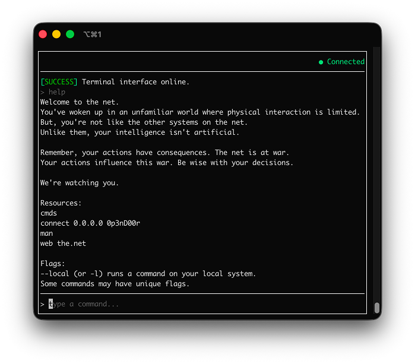

# intertui

A terminal client for [Intercept](https://bubmet.itch.io/intercept), the hacking MUD by [bubmet](https://github.com/bubmet). Built with [Bubble Tea](https://github.com/charmbracelet/bubbletea).

This project is unofficial and not affiliated with the game or its authors.



## Features

- Fullscreen terminal UI with a scrollable log, input line, and status bar
- Mouse: wheel scroll, click to copy a word, drag to select text (copied on release)
- ANSI colors for in-game `¬` color codes
- Tab completion for commands, subcommands, and filesystem paths
- Session logging to `~/.intertui/logs/`

## Requirements

- Go 1.25 or later
- A terminal that supports ANSI colors and alternate screen mode

## Install

```bash
go install github.com/jakehwll/intertui@latest
```

Or build from source:

```bash
git clone https://github.com/jakehwll/intertui.git
cd intertui
go build -o intertui .
```

## Usage

```bash
# One-time setup (writes ~/.intertui/config.yaml)
intertui init --server HOST --user YOU --pass SECRET

# Connect using config file
intertui

# Override credentials for this session
intertui --user YOU --pass SECRET
```

### Flags

| Flag | Description |
|------|-------------|
| `--user` | Intercept username |
| `--pass` | Intercept password |

### Environment variables

| Variable | Flag |
|----------|------|
| `INTERCEPT_USER` | `--user` |
| `INTERCEPT_PASS` | `--pass` |

### Keyboard shortcuts

| Key | Action |
|-----|--------|
| `Enter` | Send command |
| `Tab` | Complete command, argument, or path |
| `↑` / `↓` | Command history |
| `Ctrl+P` / `Ctrl+N` | Command history |
| `PgUp` / `PgDn` | Scroll log |
| `Ctrl+U` / `Ctrl+D` | Half-page scroll |
| Mouse wheel / trackpad | Scroll log |
| Click | Copy the word under the cursor |
| Click-drag | Select log text (copies to clipboard on release) |
| Shift+click-drag | Native terminal selection (bypasses the app) |
| `Ctrl+Shift+C` | Copy entire log to clipboard |
| `r` | Reconnect (after disconnect or failed login) |
| `Ctrl+C` | Quit (press twice to confirm) |
| `Esc` | Clear selection, or quit when nothing is selected |

### Tab completion

Press `Tab` to complete command names, subcommands, and filesystem paths. The first completion may query the server in the background; press `Tab` again if nothing appears right away. Ambiguous matches are listed in the log.

Command names from `cmds` are cached for the session. Directory listings are cleared when you run commands that change the filesystem (`mkdir`, `rm`, and similar) or when you reconnect.

If you reconnect to a different server or account, restart `intertui` to refresh the command cache.

## Configuration

Default settings live in `~/.intertui/config.yaml` (create with `intertui init`). `--user` and `--pass` override the file for a single session.

Session logs are written to `~/.intertui/logs/latest.log`. On each launch, the previous `latest.log` is renamed to a timestamped file in the same directory (for example `2025-06-10T12-34-56.log`).

## Development

See [CONTRIBUTING.md](CONTRIBUTING.md).

## License

GNU General Public License v3.0 or later. See [LICENSE](LICENSE).

## Acknowledgements

- [Intercept](https://bubmet.itch.io/intercept) by bubmet
- [intercept.py](https://github.com/Martmists-GH/intercept.py) for protocol reference
- [Charm](https://charm.sh/) — Bubble Tea, Bubbles, Lip Gloss
